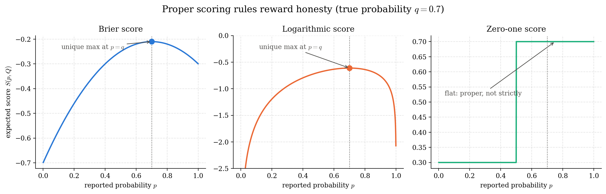
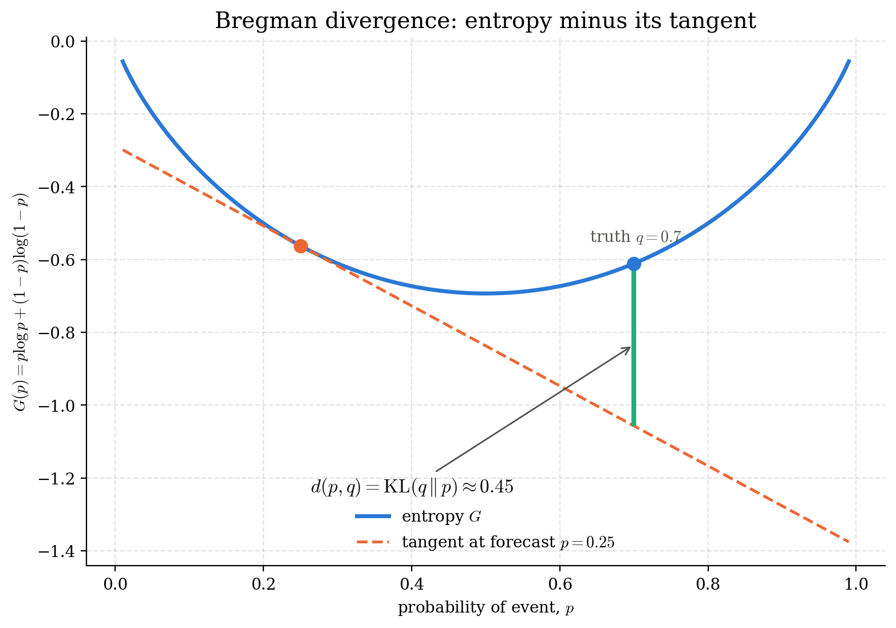
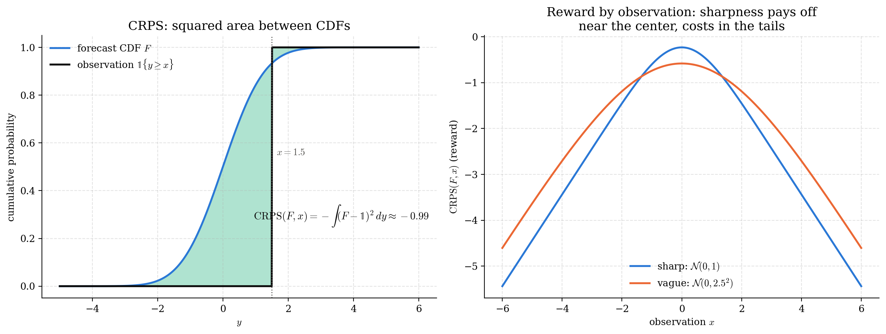
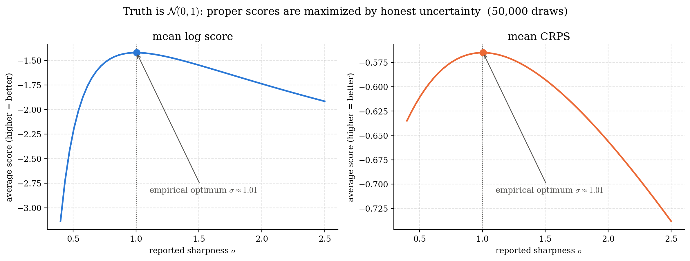

# Scoring Rules for Probabilistic Forecasting

Seminar talk, written summary and companion code on **proper scoring rules**, the theory of how to evaluate forecasts that come as full probability distributions rather than point predictions.

Prepared by **Loay Hefni** for the *Uncertainty in Machine Learning* seminar (TU Berlin, talk given 27 November 2025). The material follows Gneiting & Raftery's classic paper [*Strictly Proper Scoring Rules, Prediction, and Estimation*](https://doi.org/10.1198/016214506000001437) (JASA, 2007).

## The idea in one paragraph

A weather service that says *"23 °C tomorrow"* is easy to grade; one that hands
you a whole distribution over temperatures is not. A **scoring rule**
$S(P, \omega)$ rewards a forecast distribution $P$ once the outcome $\omega$ is
observed. The crucial property is **(strict) properness**: a forecaster who
believes the truth is $Q$ should maximize their expected score by actually
reporting $Q$, honesty must be the optimal strategy. The talk develops this
theory from scratch: properness, the associated convex **entropy functions**
and **Bregman divergences**, the classical categorical scores (Brier,
logarithmic, zero-one), scores for densities and CDFs (**CRPS**), the unifying
view through **kernel scores**, and proper scores for **quantile** forecasts
(interval score, Value at Risk).

## The theory in pictures

All figures are generated by [code/visualize_theory.py](code/visualize_theory.py). Run it yourself with `python code/visualize_theory.py`.

### Properness: honesty is the best policy

For a binary event with true probability $q = 0.7$, the *expected* Brier and
logarithmic scores are uniquely maximized by reporting $p = q$. The zero-one
score is proper but **not strictly** proper, every report on the correct side
of $1/2$ scores the same, so it cannot distinguish an honest forecaster from a
lazy one.



### Divergences: the geometry behind proper scores

Every proper score has a convex entropy $G$, and its divergence
$d(P, Q) = S(Q,Q) - S(P,Q)$ is the gap between $G$ and its tangent at the
forecast, a **Bregman divergence**. For the logarithmic score this gap is
exactly the Kullback–Leibler divergence.



### CRPS: scoring cumulative distribution functions

The Continuous Ranked Probability Score is the (negative) squared area between
the forecast CDF and the step function of the observation. Unlike the log
score it is sensitive to *distance*: a near miss beats a far miss, and
sharpness pays off near the center but costs in the tails.



### Monte Carlo: proper scores punish dishonest uncertainty

Nature draws from $\mathcal{N}(0,1)$; forecasters report
$\mathcal{N}(0,\sigma^2)$ with varying sharpness. Averaged over 50 000 draws,
both the log score and the CRPS peak at the honest $\sigma = 1$, neither
overconfidence nor underconfidence helps.



## Repository structure

```
├── code/                             Python figure code (numpy / scipy / matplotlib)
│   ├── visualize_theory.py           NEW: properness, Bregman divergence, CRPS, Monte Carlo
│   ├── forecast_distributions.py     motivating forecaster figures for the intro slides
│   ├── lognormal_median_vs_mean.py   counterexample: the improper "linear score"
│   ├── divergence_distributions.py   distributions figure for the divergence slides
│   ├── subdifferential.py            subgradients of a convex function at a kink
│   └── figures/                      generated PNGs
├── Seminar_Talk/
│   ├── main.tex                      Beamer slides (TU Berlin theme)
│   ├── Summary/                      written summary (LaTeX)
│   ├── images/                       figures used in the slides
│   └── References/refs.bib           bibliography
└── requirements.txt
```

## Reproducing everything

```bash
pip install -r requirements.txt

# regenerate all figures into code/figures/
python code/visualize_theory.py
python code/forecast_distributions.py
python code/lognormal_median_vs_mean.py
python code/divergence_distributions.py
python code/subdifferential.py

# build the slides (needs a LaTeX distribution)
cd Seminar_Talk && latexmk -pdf main.tex
```

The talk scripts use real LaTeX for text rendering when a `latex` binary is on
the `PATH` and fall back to matplotlib's mathtext otherwise.

## Main references

- T. Gneiting, A. E. Raftery — *Strictly Proper Scoring Rules, Prediction, and Estimation*, JASA 102 (2007).
- J. Kohonen, J. Suomela — *Lessons Learned in the Challenge: Making Predictions and Scoring Them* (2006).
- D. Duffie, J. Pan — *An Overview of Value at Risk*, J. Derivatives 4 (1997).
- D. A. Unger — *A Method to Estimate the Continuous Ranked Probability Score* (1985).
- J. Quiñonero-Candela et al. — *Evaluating Predictive Uncertainty Challenge* (2005).
